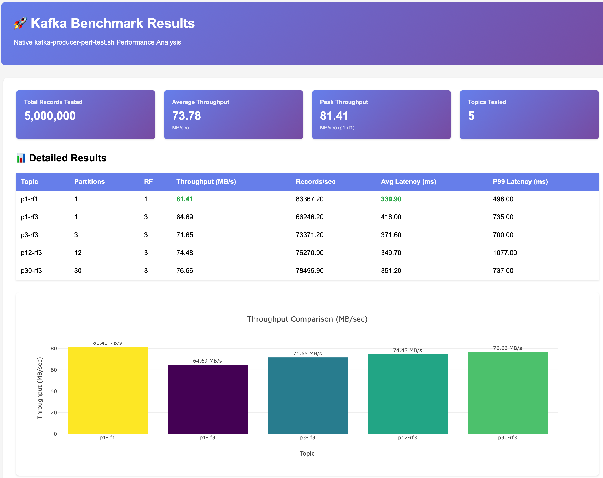
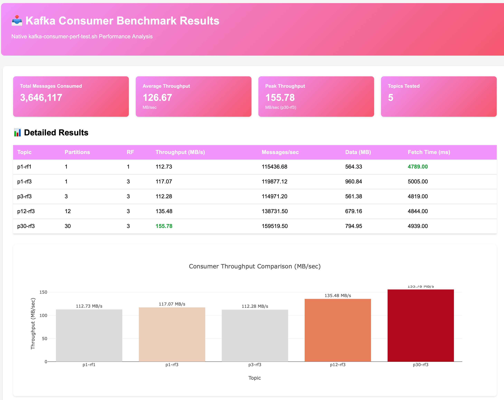
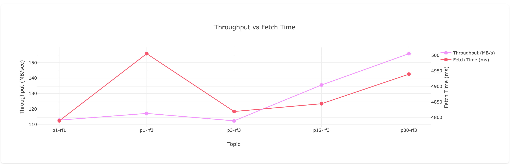
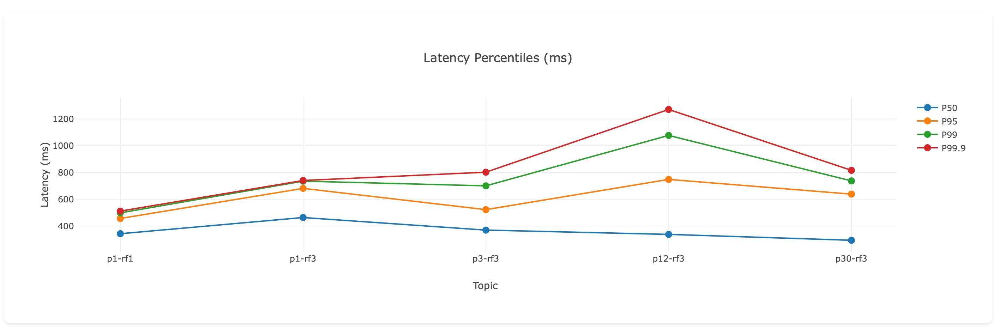

# Kafka Performance Testing Suite 🚀

Professional benchmarking tools for Apache Kafka - measure producer and consumer performance with beautiful HTML reports.

[](https://kafka.apache.org/)
[](https://www.python.org/)
[](https://www.gnu.org/software/bash/)
[](LICENSE)

## 📊 Features

- ⚡ **Native Performance** - Uses Kafka's built-in `kafka-producer-perf-test.sh` and `kafka-consumer-perf-test.sh`
- 📈 **Interactive HTML Reports** - Beautiful charts with Plotly
- 🐍 **Python & Bash** - Choose your preferred implementation
- 🔒 **TLS/SASL Support** - Test secure clusters with config files
- 📉 **Comprehensive Metrics** - Throughput, latency, percentiles (P50, P95, P99, P99.9)
- 💾 **CSV Export** - Easy analysis in Excel/Google Sheets
- 🎯 **Topic Comparison** - Test multiple partition/replication configurations

## 🎬 Quick Start

### Prerequisites

- Kafka cluster running (local or remote)
- Kafka binaries installed
- Python 3.8+ (for Python version) or Bash (for native version)

### 🐳 Running Kafka Locally with Docker

Don't have a Kafka cluster? No problem! Use the included `docker-compose.yml` to run a complete 3-broker Kafka cluster locally:

```bash
# Start the Kafka cluster (3 brokers + Kafbat UI)
docker-compose up -d

# Wait for cluster to be ready (~30 seconds)
sleep 30

# Verify cluster is running
docker-compose ps

# Create test topics
./create-topics.sh

# Run benchmarks
./producer-benchmark-runner.sh
./consumer-benchmark-runner.sh

# Access Kafbat UI for cluster monitoring
open http://localhost:8090

# Stop the cluster when done
docker-compose down
```

**What's included:**
- ✅ **3 Kafka Brokers** (KRaft mode, no Zookeeper needed)
  - `kafka-1`: localhost:29092
  - `kafka-2`: localhost:39092
  - `kafka-3`: localhost:49092
- ✅ **Kafbat UI** (http://localhost:8090) - Monitor topics, messages, and cluster health
- ✅ **Apache Kafka 4.1.1** - Latest stable version with native image
- ✅ **Ready for RF=3** - Full replication factor support

**Ports exposed:**
- `29092`, `39092`, `49092` - Kafka brokers
- `8090` - Kafbat UI web interface

**Default bootstrap servers:**
```bash
BOOTSTRAP_SERVERS="localhost:29092,localhost:39092,localhost:49092"
```

This configuration is already set as the default in all benchmark scripts!

### Option 1: Native Bash Scripts (Recommended)

**Producer Benchmark:**
```bash
# Simple test
./producer-benchmark-runner.sh

# With TLS configuration
PRODUCER_CONFIG=producer.config ./producer-benchmark-runner.sh

# Custom settings
NUM_RECORDS=5000000 RECORD_SIZE=2048 ./producer-benchmark-runner.sh
```

**Consumer Benchmark:**
```bash
# Simple test
./consumer-benchmark-runner.sh

# With TLS configuration
CONSUMER_CONFIG=consumer.config ./consumer-benchmark-runner.sh

# Custom message count
NUM_MESSAGES=2000000 ./consumer-benchmark-runner.sh
```

### Option 2: Python Implementation

```bash
cd python-example

# Run benchmark
./run_benchmark.sh

# Or directly with Python
pip install -r requirements.txt

python3 kafka_benchmark.py --bootstrap-servers localhost:9092
```

## 📸 Sample Results

### Producer Performance Report

<div align="center">
  
  <p><em>Interactive dashboard showing throughput, latency, and records/sec across different topic configurations</em></p>
</div>

### Consumer Performance Report

<div align="center">
  
  <p><em>Consumer throughput and fetch time analysis across different partition configurations</em></p>
</div>

**Key Metrics:**
- 📥 **Peak Throughput**: Consumer performance scales with partitions
- ⏱️ **Fetch Time**: Lower with more partitions
- 🔄 **Messages/sec**: Optimized for parallel consumption

### Sample Charts

| Throughput Comparison | Latency Percentiles |
|:---------------------:|:-------------------:|
|  |  |

## 📁 Project Structure

```
kafka-perf-test/
├── producer-benchmark-runner.sh      # Native producer benchmark
├── consumer-benchmark-runner.sh      # Native consumer benchmark
├── producer.config                   # Producer configuration template
├── consumer.config                   # Consumer configuration template
├── CONFIG_GUIDE.md                   # Guide for TLS/SASL configurations
├── NATIVE_BENCHMARK_GUIDE.md         # Complete native script documentation
├── docker-compose.yml                # Local Kafka cluster for testing
├── python-example/                   # Python implementation
│   ├── kafka_benchmark.py            # Main benchmark script
│   ├── requirements.txt              # Python dependencies
│   ├── run_benchmark.sh              # Wrapper script
│   └── BENCHMARK_GUIDE.md            # Python version guide
└── benchmark_results/                # Generated reports (git-ignored)
    ├── results_TIMESTAMP.csv
    ├── report_TIMESTAMP.html
    └── raw/
```

## 🎯 What Gets Tested

### Topics Configuration

| Topic | Partitions | Replication Factor | Purpose |
|-------|------------|-------------------|---------|
| p1-rf1 | 1 | 1 | Baseline (no replication) |
| p1-rf3 | 1 | 3 | Replication impact |
| p3-rf3 | 3 | 3 | Small partition count |
| p12-rf3 | 12 | 3 | Medium partition count |
| p30-rf3 | 30 | 3 | High partition count |

### Metrics Collected

#### Producer Metrics
- ✅ Throughput (MB/sec)
- ✅ Records per second
- ✅ Average latency
- ✅ Max latency
- ✅ Latency percentiles (P50, P95, P99, P99.9)

#### Consumer Metrics
- ✅ Throughput (MB/sec)
- ✅ Messages per second
- ✅ Data consumed (MB)
- ✅ Fetch time (ms)
- ✅ Rebalance time (ms)

## 🔧 Configuration Options

### Environment Variables (Bash Scripts)

**Producer:**
```bash
PRODUCER_CONFIG=file.config          # Path to producer properties file
BOOTSTRAP_SERVERS=broker1:9092       # Kafka brokers (if no config file)
NUM_RECORDS=1000000                  # Records per test
RECORD_SIZE=1024                     # Record size in bytes
KAFKA_BIN=/path/to/kafka/bin         # Kafka binaries location
```

**Consumer:**
```bash
CONSUMER_CONFIG=file.config          # Path to consumer properties file
BOOTSTRAP_SERVERS=broker1:9092       # Kafka brokers (if no config file)
NUM_MESSAGES=1000000                 # Messages per test
KAFKA_BIN=/path/to/kafka/bin         # Kafka binaries location
```

### Python Script Options

```bash
python3 kafka_benchmark.py \
    --bootstrap-servers localhost:9092,localhost:9093 \
    --kafka-bin /opt/kafka/bin \
    --num-records 5000000 \
    --record-size 2048 \
    --output-dir ./results \
    --skip-consumer  # Skip consumer tests
```

## 🔒 Testing Secure Clusters

### TLS Configuration

**producer.config:**
```properties
bootstrap.servers=kafka-ssl:9093
security.protocol=SSL
ssl.truststore.location=/etc/kafka/ssl/kafka.client.truststore.jks
ssl.truststore.password=changeit
ssl.keystore.location=/etc/kafka/ssl/kafka.client.keystore.jks
ssl.keystore.password=changeit
ssl.key.password=changeit
acks=all
```

**Run with TLS:**
```bash
PRODUCER_CONFIG=producer.config ./producer-benchmark-runner.sh
```

See [CONFIG_GUIDE.md](CONFIG_GUIDE.md) for more examples including SASL/SCRAM and AWS MSK.

## 📊 Understanding the Results

### HTML Report Sections

1. **Summary Cards** - Total records, average/peak throughput, best configuration
2. **Detailed Table** - All metrics by topic
3. **Interactive Charts**:
   - Throughput comparison (bar chart)
   - Latency analysis (grouped bar chart)
   - Records per second (bar chart)
   - Latency percentiles (line chart)

### Interpreting Performance

**High Throughput Indicators:**
- ✅ More partitions generally = higher throughput
- ✅ Proper replication factor (RF=3) with minimal overhead
- ✅ Balanced load across brokers

**Good Latency Indicators:**
- ✅ P99 latency < 100ms (excellent)
- ✅ P99 latency < 500ms (good)
- ✅ Low variance between P50 and P99

**Bottleneck Detection:**
- 🔴 Low throughput + high CPU = CPU bound
- 🔴 Low throughput + high disk util = disk I/O bound
- 🔴 Low throughput + high network = network bound

## 🚀 Example Workflows

### 1. Quick Performance Test
```bash
# Run producer benchmark
./producer-benchmark-runner.sh

# Run consumer benchmark
./consumer-benchmark-runner.sh

# View results
open benchmark_results/report_*.html
```

### 2. Compare Configurations
```bash
# Test default config
NUM_RECORDS=1000000 ./producer-benchmark-runner.sh

# Test with compression
echo "compression.type=lz4" >> producer.config
PRODUCER_CONFIG=producer.config ./producer-benchmark-runner.sh

# Compare HTML reports side-by-side
```

### 3. Production Readiness Test
```bash
# Large-scale test
NUM_RECORDS=10000000 RECORD_SIZE=2048 ./producer-benchmark-runner.sh

# Consumer lag test
NUM_MESSAGES=10000000 ./consumer-benchmark-runner.sh

# Analyze results for capacity planning
```

## 🛠️ Troubleshooting

### Common Issues

**"Could not find Kafka binaries"**
```bash
KAFKA_BIN=/path/to/kafka/bin ./producer-benchmark-runner.sh
```

**"Connection refused"**
- Check if Kafka is running: `kafka-topics.sh --bootstrap-server localhost:9092 --list`
- Verify bootstrap servers are correct

**"Topics don't exist"**
```bash
# Create test topics
kafka-topics.sh --create --bootstrap-server localhost:9092 \
  --topic p1-rf1 --partitions 1 --replication-factor 1
```

**Consumer tests return no data**
- Run producer tests first to populate topics
- Check topic has data: `kafka-console-consumer.sh --bootstrap-server localhost:9092 --topic p1-rf1 --from-beginning --max-messages 1`

## 🐳 Local Testing with Docker

Start a local Kafka cluster:
```bash
docker-compose up -d

# Wait for cluster to be ready
sleep 10

# Create test topics
./create-topics.sh

# Run benchmarks
./producer-benchmark-runner.sh
./consumer-benchmark-runner.sh
```

## 📚 Documentation

- [CONFIG_GUIDE.md](CONFIG_GUIDE.md) - Configuration file examples (TLS, SASL, AWS MSK)
- [NATIVE_BENCHMARK_GUIDE.md](NATIVE_BENCHMARK_GUIDE.md) - Complete bash script guide
- [python-example/BENCHMARK_GUIDE.md](python-example/BENCHMARK_GUIDE.md) - Python implementation guide

## 🤝 Contributing

Contributions are welcome! Please feel free to submit a Pull Request.

### Development Setup

```bash
# Clone the repository
git clone https://github.com/yourusername/kafka-perf-test.git
cd kafka-perf-test

# For Python development
cd python-example
python3 -m venv venv
source venv/bin/activate
pip install -r requirements.txt

# Run tests
./run_benchmark.sh
```

## 📝 License

This project is licensed under the Apache License 2.0 - see the LICENSE file for details.

## 🙏 Acknowledgments

- Built with [Apache Kafka](https://kafka.apache.org/)
- Charts powered by [Plotly](https://plotly.com/)
- Inspired by Kafka's native performance testing tools

## 📞 Support

- 🐛 [Report a Bug](https://github.com/mordp1/kafka-perf-test/issues)
- 💡 [Request a Feature](https://github.com/mordp1/kafka-perf-test/issues)
- 📖 [Documentation](https://github.com/mordp1/kafka-perf-test/wiki)

---

**⭐ If this project helped you, please consider giving it a star!**

Made with ❤️ for the Kafka community
